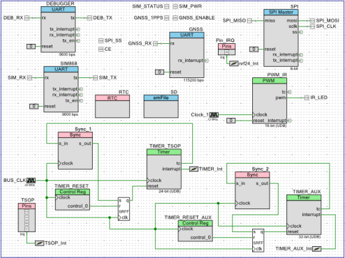

# SIM868-Library

This library provides full functionality of the SIM868 wireless module. Some of the features included within the library are 2G wireless communication, satellite navigation, and HTTP requests. The library is compatible across different  platforms and development boards with little changes in the header file.

## Project

This library was part of a vehicle GPS tracking device for public transport units. The microcontroller chosen for the application was the Cypress PSoC 5LP, a Cortex-M3 programmable system on chip device.

  

## Software

* PSoc Creator.

## License

This project is licensed under the MIT License - see the [LICENSE.md](LICENSE.md) file for details
